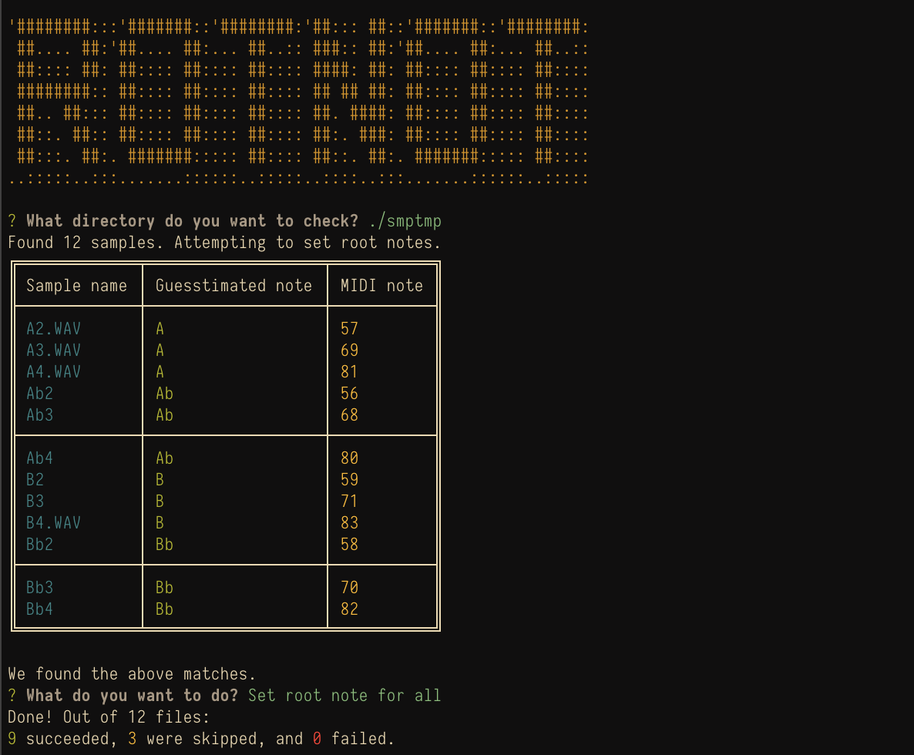

# Rotnot

## What is this?
Rotnot tries to figure out the notes of sound samples based on their filename, and save that note as meta data in the file.

At the moment it works on a bunch of multi sampled instruments I had available, where the filename were either:
- Note+octave (a#4.wav)
- Collection_name-note+octave (MutedTrumpet-Bb2.wav); or
- The actual midi note (031.wav)

The midi note is then written back to the wave file as part of the "Sampler Chunk", in the `MIDI Unity Note` slot.

TODO: The "Instrument Chunk" har a slot with similar purpose, `MIDI Unshifted Note`. Consider writing to that as well.

